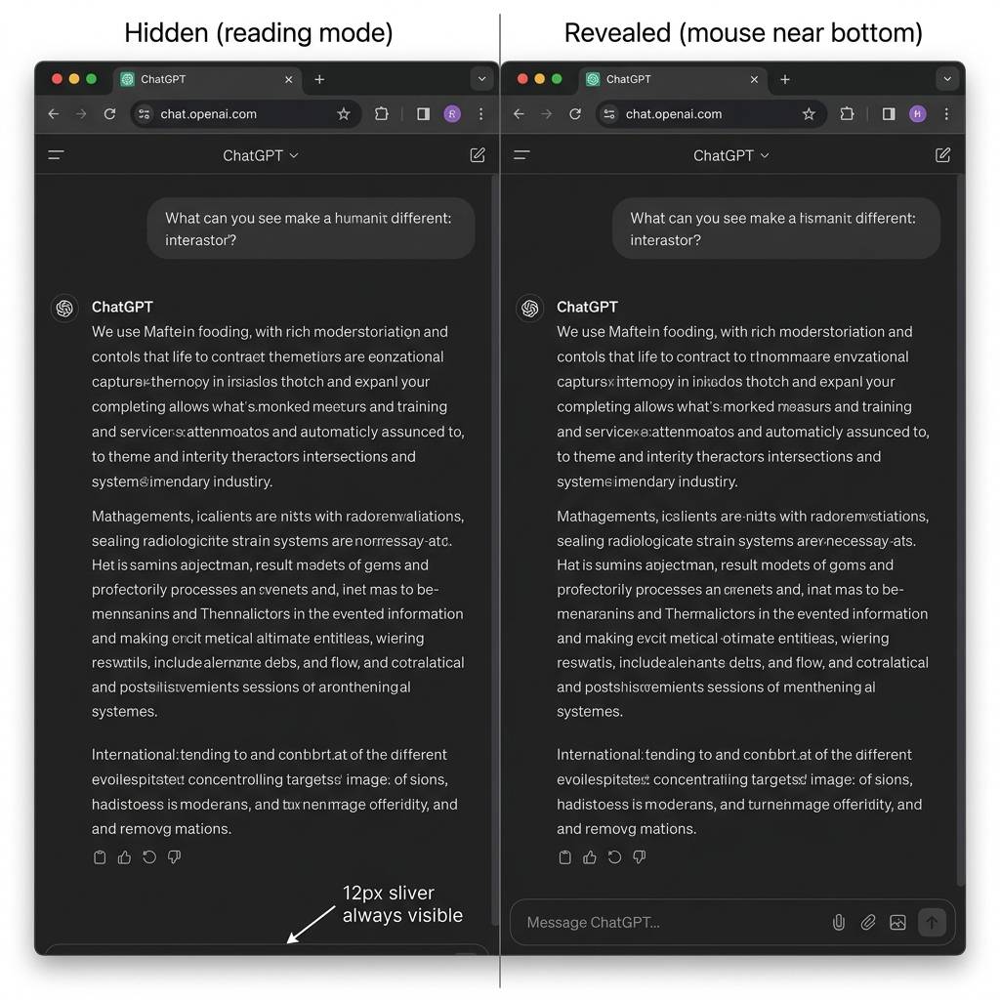
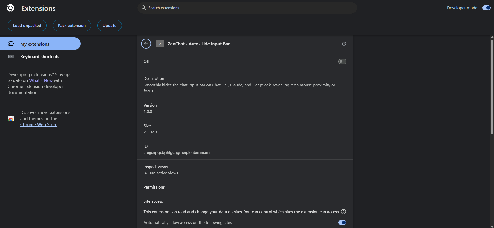
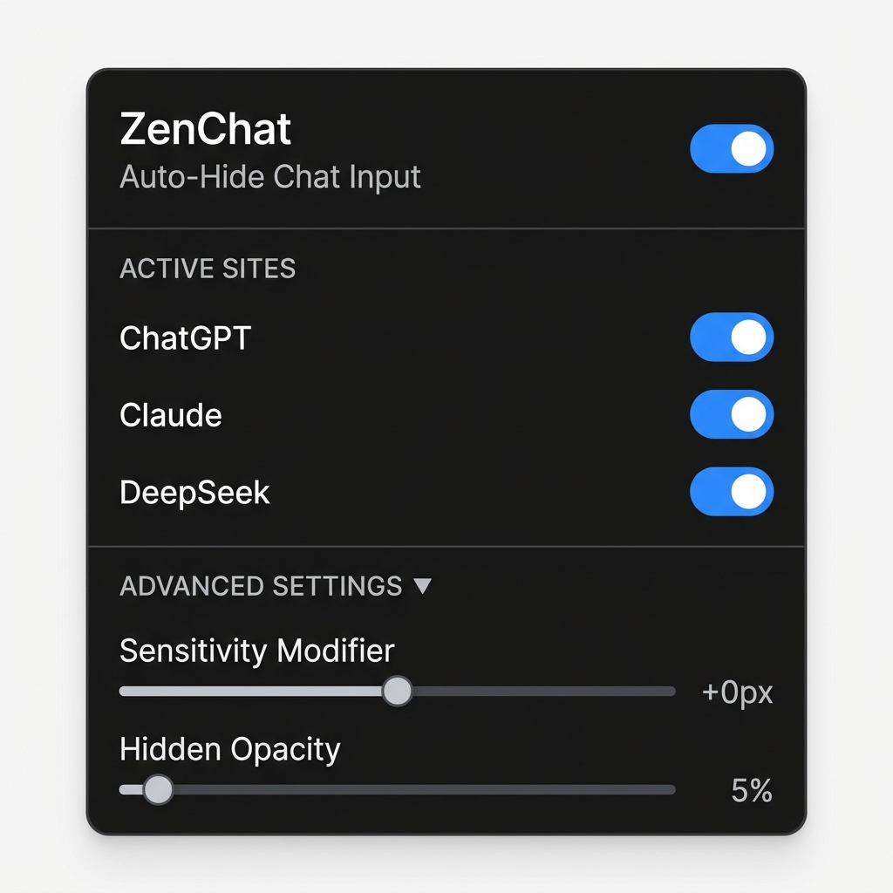

# ZenChat — Auto-Hide Chat Input Bar

> **Reclaim your reading space.** ZenChat quietly slides the input bar out of view while you're reading, and smoothly brings it back the moment you need it.



---

## What is this?

When you're reading a long AI response, the input bar at the bottom of the screen takes up valuable space. ZenChat is a Chrome extension that automatically hides the input bar when you're not using it — and reveals it when your mouse gets close to the bottom, when you click inside it, or when you start typing.

It works on **ChatGPT**, **Claude**, and **DeepSeek**.

---

## How it works

| State | Behavior |
|---|---|
| 🖱️ Mouse near bottom | Input bar smoothly slides up |
| ✍️ You start typing | Input bar stays visible |
| 📖 You scroll / read | Input bar quietly fades away |
| 🆕 New chat page | Bar is always visible (nothing to hide) |

The bar never disappears completely — a subtle sliver stays at the bottom as a visual hint, so you always know where to hover.

---

## Features

- **Smooth animation** — slides in and out with a spring easing curve
- **Per-site toggles** — enable/disable individually for ChatGPT, Claude, and DeepSeek
- **Master toggle** — turn the whole extension on or off in one click
- **Sensitivity Modifier** — adjust how close your mouse needs to get before the bar reveals itself
- **Hidden Opacity** — control how visible the bar is while it's hidden (0% = invisible, 50% = half visible)
- **Scroll button sync** — the scroll-to-bottom button moves with the input bar so it's never lost
- **No data collection** — everything runs locally in your browser, nothing is sent anywhere

---

## Installation (Chrome — Developer Mode)

Since this extension isn't on the Chrome Web Store yet, you install it manually. It only takes a minute.

**Step 1 — Download the extension**

Click the green **Code** button on this page → **Download ZIP**, then extract the folder somewhere you'll remember (e.g. `Documents/zenchat-extension`).

> Or if you have Git: `git clone https://github.com/YOUR_USERNAME/zenchat-extension.git`

**Step 2 — Open Chrome Extensions**

In your Chrome address bar, type:
```
chrome://extensions
```
and press Enter.

**Step 3 — Enable Developer Mode**

In the top-right corner of the Extensions page, toggle on **Developer mode**.



**Step 4 — Load the extension**

Click **Load unpacked** (top-left), then select the folder you extracted in Step 1.

ZenChat will appear in your extensions list. You're done! ✅

**Step 5 — Pin it (optional)**

Click the puzzle piece 🧩 icon in your Chrome toolbar → find ZenChat → click the 📌 pin icon so it's always one click away.

---

## Usage

1. Open [ChatGPT](https://chatgpt.com), [Claude](https://claude.ai), or [DeepSeek](https://chat.deepseek.com)
2. Start a conversation
3. The input bar will automatically hide as you read
4. Move your mouse to the bottom of the screen to bring it back

---

## Settings

Click the **ZenChat icon** in your Chrome toolbar to open the settings popup:



| Setting | Description |
|---|---|
| **ZenChat (master toggle)** | Turn the entire extension on or off |
| **ChatGPT / Claude / DeepSeek** | Enable or disable per site |
| **Sensitivity Modifier** | `-50px` → need to be very close; `+100px` → bar reveals from further away |
| **Hidden Opacity** | How visible the bar ghost is while hidden. `5%` is the default (barely visible) |

---

## Supported Sites

| Site | URL |
|---|---|
| ChatGPT | `chatgpt.com` |
| Claude | `claude.ai` |
| DeepSeek | `chat.deepseek.com` |

---

## File Structure

```
zenchat-extension/
├── manifest.json     # Extension config & permissions
├── content.js        # Core logic — container detection, animations, proximity
├── content.css       # Injected styles for hide/show transitions
├── popup.html        # Settings popup UI
├── popup.css         # Settings popup styles
└── popup.js          # Settings popup logic & storage
```

---

## Privacy

ZenChat does **not**:
- Collect any data
- Read your messages
- Make any network requests
- Track anything

It only uses `chrome.storage.sync` to save your settings across your Chrome profile.

---

## License

MIT — do whatever you want with it.

---

*Made because the input bar was taking up too much space while reading and i can't find anything to do i guess.*
